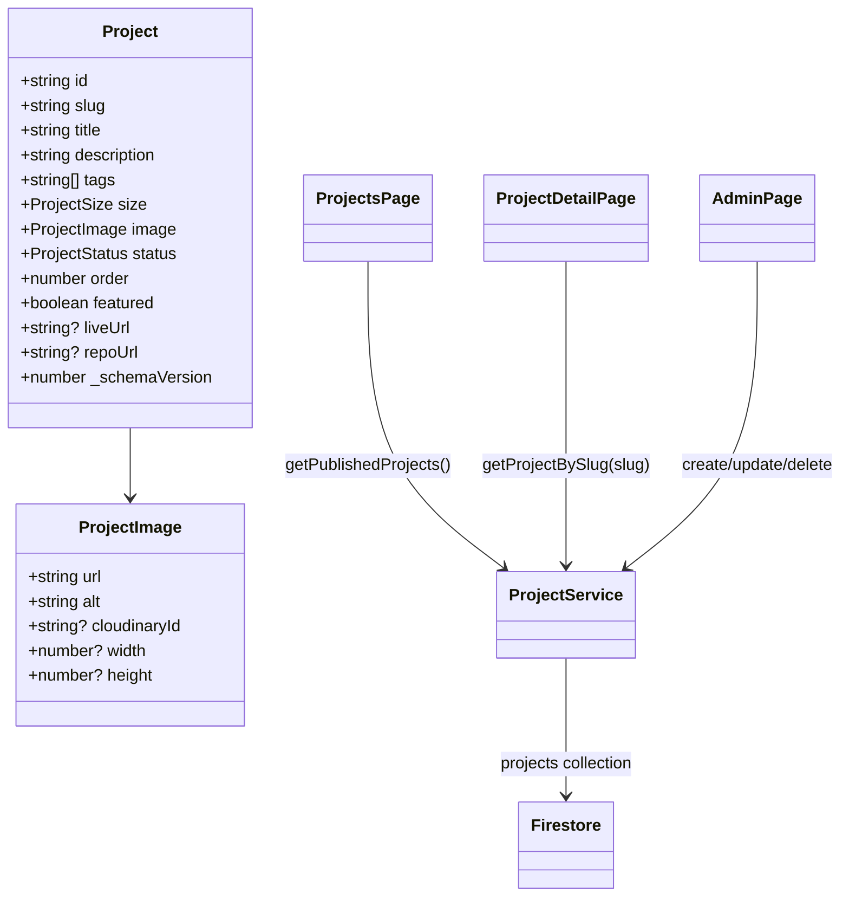

# Projects CMS Architecture

## System Flow

```mermaid
graph TB
    subgraph Client
        A[User] --> B[GlassNavbar]
        B --> C[/projects Index]
        C --> D[/projects/[slug] Detail]
        A --> E[Admin Login]
        E --> F[Admin Projects Tab]
    end

    subgraph Next.js App Router
        C --> G[ProjectsPage Client Fetch]
        D --> H[ProjectDetailPage Client Fetch]
        F --> I[AdminPage Client Mutations]
    end

    subgraph Firebase
        G --> J[(Firestore projects)]
        H --> J
        I --> J
        I --> K[Firebase Auth]
    end

    subgraph Media
        I --> L[Cloudinary Upload API]
        L --> I
    end
```

## UML-style Mapping


